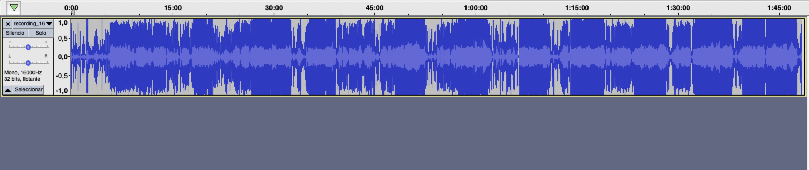
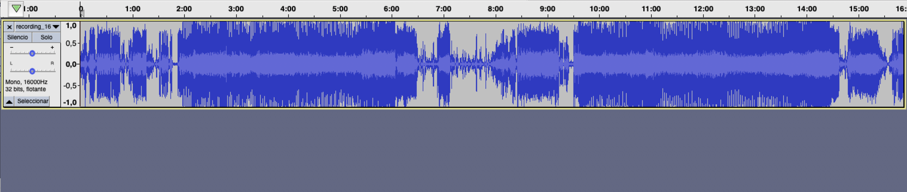

# Split Band Rehearsal Recording Into Songs

This is a small program that I made to split audios from my band rehearsal into separate tracks to share with the band. It is far from perfect but it greatly ease the process of splitting songs. At this moment it split the songs correctly but sometimes creates tracks with continuous audios of we being distracted.

## About the splitter

Script to separate a band rehearsal recording (wav file) into songs. It's been tested with files recorded using a smartphone (high noise and saturated audio) and a Zoom audio recorder (low noise and no saturation).

Audio files combine people talking about life, intruments tuning, gear and drum setting, random instrument parts and some songs.

Some heuristics are used to identify and split songs. Later use of audacity to fine tuning the end of songs is recommended.

An example of waveform of a real rehearsal is shown below.

Zoom to a section with two songs.

## Heuristics

* Audio data is transformed into a binary sequence using a threshold.
* The threshold is manually set or obtained with a clustering approach to get the center of the low values and high values, and then entablish the threshold with a value inbetween.
* Silences are defined as 5 seconds of samples below the threshold. 
* To identify a song there must be continous sounds without silences for 90 seconds.
* 3 seconds are added at the beginning and at the end of an automatically detected song, to include the count-in before the song and some final comments or reactions.